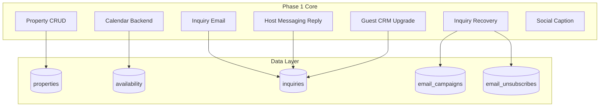

# Brisa — Product Roadmap Execution Plan

The platform evolves through **three phases**: Phase 1 (Host Growth MVP), Phase 2 (Direct Booking Platform), Phase 3 (Host Ecosystem). This plan focuses on **Phase 1 execution** — the next 6 features that unlock host growth and position the platform as **the growth layer for hosts** (not competing with Airbnb/Guesty directly).

**Timeline:** Target ~8 weeks of development to launch Phase 1 MVP and impress early hosts.

---

## Current State Snapshot

| Feature       | Status   | Notes                                                                                             |
| ------------- | -------- | ------------------------------------------------------------------------------------------------- |
| Property CRUD | Partial  | Airbnb import only; Add/Edit modals exist (UI) but no backend; No delete; Images = JSON URLs only |
| Calendar      | UI only  | Month/week/year views, `DateAvailabilityModal` — no backend persistence, `events` = `[]`          |
| Inquiry flow  | Complete | `POST /listing/{id}/inquire` creates inquiry; no email to host                                    |
| Guest CRM     | Basic    | Derived from inquiries; no tags, notes, guest history view                                        |
| Marketing     | None     | `docs/marketing-page.md` spec exists; no implementation                                           |

**Stack:** Laravel 12, React 19, Inertia.js, Tailwind, shadcn. Mail: `HostAccessCodeMail` pattern available.

---

## Phase 1 — Next 6 Features (Implementation Order)

### 1. Property CRUD (Create, Edit, Delete, Image Upload)

**Goal:** Hosts can manage properties without Airbnb import.

**Backend:**

- New routes: `POST /properties`, `PUT /properties/{id}`, `DELETE /properties/{id}`
- Move inline `web.php` logic into a dedicated `PropertyController`
- Image upload: Add `property_images` table or keep `images` JSON; use Laravel Storage (local/S3) with `Storage::disk()->put()`, return public URLs
- Reuse schema from `properties` table and Airbnb import validation rules

**Frontend:**

- Wire `AddPropertyModal` / `EditPropertyModal` `onSave` to new API endpoints
- Add image upload component (drag-and-drop + URL fallback)
- Add delete button with confirmation on property details page
- Update listings page `handleSaveProperty` to call `PATCH /properties/{id}`

**Files:** [routes/web.php](routes/web.php), new `app/Http/Controllers/PropertyController.php`, [resources/js/components/add-property-modal.tsx](resources/js/components/add-property-modal.tsx), [resources/js/components/edit-property-modal.tsx](resources/js/components/edit-property-modal.tsx)

---

### 2. Availability Calendar (Backend)

**Goal:** Persist availability and blocked dates for vacancy marketing in Phase 2.

**Database:**

- Migration: `availability` table
  - `id`, `property_id`, `date` (date), `status` enum: `available`, `blocked`, `maintenance`, `pending-inquiry`
  - `reason` (nullable), `timestamps`
  - Unique `(property_id, date)`

**Backend:**

- `GET /calendar?property_id=X` — return `events` and `dateAvailability` from DB
- `POST /calendar/availability` — bulk upsert dates (property_id, dates[], status, reason)
- `DELETE /calendar/availability/{id}` or bulk delete
- Add `CalendarController` and routes

**Frontend:**

- Replace `sampleDateAvailability` and `sampleEvents` in [resources/js/pages/calendar.tsx](resources/js/pages/calendar.tsx) with Inertia props from backend
- Wire `handleSaveAvailability` / `handleRemoveAvailability` to new API
- Calendar route already passes `events` and `dateAvailability`; ensure backend populates them from DB

**Files:** New migration, new `app/Http/Controllers/CalendarController.php`, [resources/js/pages/calendar.tsx](resources/js/pages/calendar.tsx), [resources/js/components/DateAvailabilityModal.tsx](resources/js/components/DateAvailabilityModal.tsx)

---

### 3. Email Notifications for Inquiries

**Goal:** Host receives email when traveler submits inquiry. Two templates: new inquiry, inquiry response.

**Implementation:**

- **New inquiry template:** `NewInquiryMail` — sent to host when traveler submits inquiry
  - Blade view: `resources/views/emails/new-inquiry.blade.php` (traveler, dates, message, CTA to dashboard)
  - Trigger: after `Inquiry::create()` in `POST /listing/{id}/inquire` — `Mail::to($property->user)->send(new NewInquiryMail($inquiry))` (queued)
- **Inquiry response template:** `InquiryResponseMail` — used when host sends reply through platform (reply-to set to host email)
  - Covers host → traveler communication without full chat

**Files:** New `app/Mail/NewInquiryMail.php`, `app/Mail/InquiryResponseMail.php`, views, [routes/web.php](routes/web.php) (or new `InquiryController`)

---

### 4. Host Messaging Reply (Email + WhatsApp Link)

**Goal:** Hosts can reply to inquiries without full in-app chat.

**Implementation:**

- Inquiry detail view: show “Reply” with two actions:
  - **Email reply:** `mailto:traveler_email?subject=Re: [Property Name] - [dates]` — pre-filled subject, body optional
  - **WhatsApp link:** `https://wa.me/PHONE` (if `traveler_phone` exists) or “Add phone to send WhatsApp”
- No backend logic required beyond displaying the inquiry and reply buttons
- Optional: `InquiryResponseMail` template for hosts to send via platform (uses Laravel Mail with reply-to set to host)

**Files:** Inquiries page or inquiry detail component — add reply UI with `mailto:` and WhatsApp links

---

### 5. Guest CRM Upgrades (Guest History, Tags, Notes)

**Goal:** Rich guest profiles for segmentation and campaigns.

**Database:**

- `guest_tags` table: `id`, `user_id` (host), `name`, `color`
- `guest_tag_pivot`: `guest_email`, `user_id`, `tag_id` (or use `traveler_email` + `user_id` as guest identity)
- `guest_notes` table: `id`, `user_id`, `traveler_email`, `property_id`, `note`, `created_at`
- Or extend `guests` table if we migrate CRM to use it; current CRM uses inquiry-derived data. Simpler: add `guest_notes` and `guest_tags` with composite key `(user_id, traveler_email)`.

**Backend:**

- Extend CRM controller to return per-guest: inquiries (full history), stays (status=booked), tags, notes
- Endpoints: `GET /crm/guests/{email}` (guest detail), `POST /crm/guests/{email}/notes`, `PATCH /crm/guests/{email}/tags`

**Frontend:**

- CRM: add guest detail drawer/page with inquiry history, stay records, tags, notes
- Tags: multi-select or input for adding/removing tags
- Notes: simple text area with timestamp

**Files:** New migrations, CRM controller updates, [resources/js/pages/crm.tsx](resources/js/pages/crm.tsx) (or equivalent)

---

### 6. Inquiry Recovery Campaigns

**Goal:** Hosts can email guests who inquired but didn’t book.

**Database:**

- `email_campaigns` — `id`, `user_id`, `name`, `subject`, `body` (HTML), `segment_type`, `segment_config` (JSON), `recipient_count`, `status` (draft/sent/scheduled), `scheduled_at`, `sent_at`, `created_at`
- `email_unsubscribes` — `user_id`, `email`, `unsubscribed_at` (unique `user_id`, `email`)

**Segment logic (as per roadmap):**

- “Didn’t book”: `status IN (new, contacted, lost)` + optional date range
- “Booked before”: `status = 'booked'`
- “By property”: filter by `property_id`

**Backend:**

- `GET /marketing/campaigns` — list campaigns
- `POST /marketing/campaigns` — create (draft)
- `GET /marketing/campaigns/segments/preview` — count recipients for segment
- `POST /marketing/campaigns/{id}/send` — send now
- Laravel Mail + queue; templates per `docs/marketing-page.md`
- Respect `email_unsubscribes` in segment query

**Frontend:**

- New `/marketing` page with Email tab
- Create campaign flow: Step 1 (segment + property + recipient count), Step 2 (subject, body, template), Step 3 (review, test send, send/schedule)
- Campaign list with status

**Files:** New migrations, `MarketingController`, new `resources/js/pages/marketing.tsx`, mail templates

---

### 7. Social Caption Generator

**Goal:** Hosts select property photos and get captions + hashtags.

**Implementation:**

- New `/marketing` tab or page: Social
- Image picker: load property `images` (JSON), let host select one or more
- Caption generator: simple template-based (property name, location, amenities) or call OpenAI API (optional)
- Output: caption text + Costa Rica hashtags (e.g. `#CostaRica #Tamarindo #PuraVida`)
- Copy-to-clipboard button
- Optional: save to `social_posts` (draft) for later — can be Phase 2

**Files:** New marketing sub-page or tab, component for image picker + caption display

---

## Architecture Overview

---

## Recommended Build Order

1. **Property CRUD** — Unblocks onboarding without Airbnb
2. **Calendar backend** — Needed before vacancy marketing (Phase 2)
3. **Inquiry email notifications** — Quick win, high host value
4. **Host messaging reply** — Low effort (mailto + WhatsApp links)
5. **Guest CRM upgrades** — Foundation for campaigns
6. **Inquiry recovery campaigns** — Core growth engine
7. **Social caption generator** — Differentiation, moderate effort

---

## Phase 1 Growth Engine — Full Scope (Roadmap Items 5–9)

- Repeat guest campaigns (can follow inquiry recovery using “Booked before” segment)
- Review marketing engine (requires review data; not in schema yet)
- Full PMS, Stripe, direct booking pages (Phase 2)
- Host referral, traveler marketplace, SEO content engine (Phase 3)

---

## Success Metrics (Phase 1)

- 20+ hosts onboarded
- 100+ inquiries
- Repeat bookings generated via recovery campaigns

