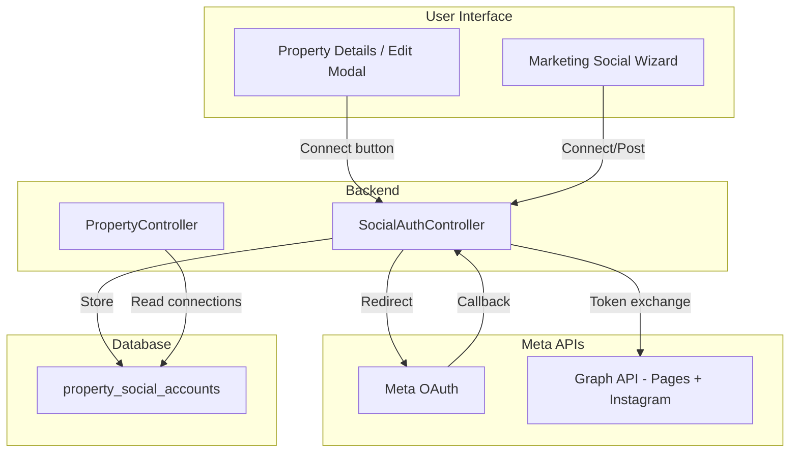

# Per-Listing Facebook & Instagram Connections

## Current State

- **Listings** = `Property` model (`[app/Models/Property.php](app/Models/Property.php)`)
- **Social flow** exists in Marketing page (`[resources/js/pages/marketing.tsx](resources/js/pages/marketing.tsx)`): image picker, caption, preview, copy-to-clipboard (no OAuth)
- **Docs** (`[docs/marketing-page.md](docs/marketing-page.md)`) outline Phase 3: OAuth posting with Meta Developer app

## Architecture




**Meta API note:** Instagram Business API requires a linked Facebook Page. Flow: User connects Facebook Page → App retrieves linked Instagram Business Account via Graph API (`/page/instagram_accounts`).

---

## 1. Database Schema

Create `property_social_accounts` table:


| Column           | Type                      | Purpose                                   |
| ---------------- | ------------------------- | ----------------------------------------- |
| id               | bigint                    | PK                                        |
| property_id      | FK → properties           | Which listing                             |
| platform         | enum: facebook, instagram | Connected platform                        |
| meta_page_id     | string, nullable          | Facebook Page ID                          |
| meta_ig_user_id  | string, nullable          | Instagram Business Account ID (from Page) |
| display_name     | string                    | Page/account name for UI                  |
| access_token     | encrypted text            | Long-lived token                          |
| token_expires_at | timestamp, nullable       | Token expiry                              |
| timestamps       |                           |                                           |


- One row per platform per property (e.g. one Facebook row, one Instagram row per property)
- Index on `(property_id, platform)` for quick lookups

Migration: `create_property_social_accounts_table`

---

## 2. Meta OAuth Setup (Prerequisites)

**Meta Developer app** (manual setup):

- App type: Business
- Products: Facebook Login for Business, Instagram Graph API
- OAuth redirect URI: `{APP_URL}/social/callback` (add to `.env`)
- Permissions: `pages_show_list`, `pages_read_engagement`, `instagram_basic`, `instagram_content_publish`

**Config** (`[config/services.php](config/services.php)`):

```php
'meta' => [
    'client_id' => env('META_APP_ID'),
    'client_secret' => env('META_APP_SECRET'),
    'redirect' => env('META_REDIRECT_URI', env('APP_URL') . '/social/callback'),
],
```

---

## 3. Backend Implementation

**Controller:** `SocialAuthController`

- `redirect(property_id, platform)` — Build Meta OAuth URL with `state=property_id|platform`, redirect user
- `callback(Request)` — Exchange code for token, fetch Page/IG accounts, upsert `property_social_accounts`
- `disconnect(property_id, platform)` — Delete connection (auth + policy: user owns property)
- `index(property_id)` — List connections for a property (for UI)

**Model:** `PropertySocialAccount`

- Belongs to `Property`
- Use Laravel's encrypted casting for `access_token`
- Scopes: `facebook()`, `instagram()`

**Routes** (inside auth middleware):

- `GET /social/connect/{property}/{platform}` → redirect
- `GET /social/callback` → handle callback
- `DELETE /social/disconnect/{property}/{platform}` → disconnect
- `GET /properties/{property}/social-accounts` → list (or include in property API)

**Policy:** Ensure authenticated user owns the property before connect/disconnect.

---

## 4. Frontend Implementation

### 4a. Connection UI placement

**Option A (recommended):** Add "Social" tab to property edit flow

- In `[add-property-modal.tsx](resources/js/components/add-property-modal.tsx)` (used by Edit Property): add a 4th tab "Social" when `isEdit`
- Or: add a dedicated "Connect social accounts" card on the property details page (`[property-details-content.tsx](resources/js/components/property-details-content.tsx)`) with connect/disconnect buttons

**Option B:** Marketing page contextual connect

- When user selects a property in Social Post Wizard, show "Connect Facebook" / "Connect Instagram" if not connected
- Link to connect flow with `property_id` in state

**Recommendation:** Both. Property details page has the main connection UI; Marketing wizard shows status and a "Connect" CTA when not connected.

### 4b. Components

1. **SocialConnectionCard** (new)
  - Shows platform icon, display name, "Connected" / "Connect" state
  - Connect button → `window.location = /social/connect/{propertyId}/facebook` (or instagram)
  - Disconnect button → `DELETE /social/disconnect/...`
2. **Property social section**
  - Renders `SocialConnectionCard` for Facebook and Instagram
  - Fetches connections via `GET /properties/{id}/social-accounts` or inline in property payload
3. **Marketing wizard integration**
  - In `[social-post-wizard.tsx](resources/js/components/social-post-wizard.tsx)` step 3 (Preview): add "Post to" section
  - Show connected accounts for selected property; "Connect" if none
  - Copy-to-clipboard remains as fallback; "Post" button calls backend (future: publish via Graph API)

---

## 5. Data Flow (OAuth Callback)

1. User clicks "Connect Facebook" for property 5
2. Redirect to Meta OAuth with `state=5|facebook`
3. User authorizes; Meta redirects to `/social/callback?code=...&state=5|facebook`
4. Controller: parse state, exchange code for user token, fetch Pages with `me/accounts`, let user pick Page (or use first), get long-lived Page token
5. For Instagram: call `/{page-id}?fields=instagram_business_account` to get IG account
6. Upsert `property_social_accounts` for property 5 with platform=facebook and platform=instagram (if IG linked)
7. Redirect back to property page or marketing page with success toast

---

## 6. Security Considerations

- Encrypt `access_token` in DB (Laravel `encrypted` cast)
- Validate `property_id` in state parameter; verify user owns property
- Use HTTPS for redirect URI
- Store tokens server-side only; never expose to frontend

---

## 7. Out of Scope (Future)

- **Direct posting** from wizard to Facebook/Instagram via Graph API (separate effort)
- Account-level connections (host default) with per-listing override
- Token refresh logic (long-lived tokens last ~60 days; add refresh job later)

---

## Key Files to Create/Modify


| Action | File                                                                                                    |
| ------ | ------------------------------------------------------------------------------------------------------- |
| Create | `database/migrations/xxxx_create_property_social_accounts_table.php`                                    |
| Create | `app/Models/PropertySocialAccount.php`                                                                  |
| Create | `app/Http/Controllers/SocialAuthController.php`                                                         |
| Create | `app/Policies/PropertySocialAccountPolicy.php` (or use Property policy)                                 |
| Modify | `app/Models/Property.php` — add `socialAccounts()` relation                                             |
| Modify | `config/services.php` — add `meta` config                                                               |
| Modify | `.env.example` — add `META_APP_ID`, `META_APP_SECRET`, `META_REDIRECT_URI`                              |
| Modify | `routes/web.php` — add social auth routes                                                               |
| Create | `resources/js/components/social-connection-card.tsx`                                                    |
| Modify | `resources/js/components/property-details-content.tsx` or `add-property-modal.tsx` — add social section |
| Modify | `resources/js/components/social-post-wizard.tsx` — show connection status in step 3                     |


